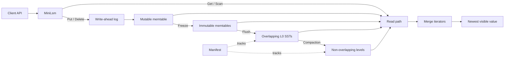

# tiny-lsm course starter

`tiny-lsm` is a C++20 course port of
[Mini-LSM](https://github.com/skyzh/mini-lsm). This branch is deliberately
incomplete: it is the starter scaffold, not a working storage engine.

## Branches

- `course` is the exercise branch. It contains explicit chapter-labeled TODOs.
- `solution-checkpoints` preserves completed solutions for reference or
  instructor use.

Completed checkpoint tags belong to the preserved solution history; they are
not the workflow for starting an exercise.

## Accelerated course cadence

We complete two original course chapters per workday. This produces a working
LSM database after four accelerated days and completes the full persistence
and MVCC course in eleven accelerated days. Compressing all 21 chapters into
seven days would require three chapters—and roughly six to nine focused
hours—every day.

The accelerated schedule is:

1. Week 1 Days 1–2: memtable, database state, merge iterators, and range scans.
2. Week 1 Days 3–4: block encoding and SST encoding.
3. Week 1 Days 5–6: unified reads, writes, freezing, and flushing.
4. Week 1 Day 7 + Week 2 Day 1: filters/prefix encoding and basic compaction.
5. Week 2 Days 2–3: simple leveled and tiered/universal compaction.
6. Week 2 Days 4–5: leveled compaction and the manifest.
7. Week 2 Days 6–7: WAL/recovery and Week 2 refinements.
8. Week 3 Days 1–2: timestamped keys, memtables, writes, and compaction.
9. Week 3 Days 3–4: transaction snapshots, watermarks, and garbage collection.
10. Week 3 Days 5–6: transaction workspaces, atomic commits, and validation.
11. Week 3 Day 7: compaction filters, integration tests, and final review.

Days 1–7 of Week 1 are complete. The next workday is **Week 2 Days 1–2**,
beginning with compaction.

For each accelerated workday:

1. Read both chapters, but implement and test them sequentially.
2. Preserve the checkpoint invariants and tests for each individual chapter.
3. Configure and build:

   ```sh
   cmake --preset default
   cmake --build --preset default
   ```

4. Run the current and all prior exercise tests:

   ```sh
   ctest --preset default --output-on-failure
   ```

An active exercise test is expected to fail until its TODOs are implemented.
Do not remove or weaken tests to make a checkpoint pass.

To list all current and future course work:

```sh
rg 'TODO\(' include src
```

## Starter scope

The active build contains memtables, merge iterators, prefix-encoded blocks,
SSTs with Bloom filters and a block cache, a unified read path, and memtable
flushing into overlapping L0 files. Later chapters—compaction, persistence,
and MVCC transactions—remain declarations or explicit source skeletons.

Requirements: CMake 3.21 or newer, Ninja, and a compiler with C++20 support.
The library target is `tiny_lsm::tiny_lsm`; public headers are under
`include/tiny_lsm`.

## Production and performance track

After the course, the project targets a narrower production-inspired role:

> A modern C++ embedded LSM storage engine focused on predictable tail latency,
> workload-aware compaction, and asynchronous NVMe I/O.

The [production roadmap](docs/production-roadmap.md) converts recent PVLDB
research into measurable phases: crash safety and benchmarks first, followed
by lazy reads, sustainable write admission, adaptive compaction, a portable
I/O abstraction with an `io_uring` backend, SSD-aware layout, and multicore
optimization. The roadmap deliberately keeps experimental learned policies
behind deterministic baselines and safety controls.

## Architecture

The completed engine follows the standard LSM-tree split between a fast
in-memory write path, immutable on-disk files, and a merged read path:



### Write path

1. `Put` and `Delete` enter the mutable memtable; deletion is stored as an
   empty-value tombstone.
2. When the memtable reaches its target size, it becomes immutable and a new
   mutable memtable accepts writes.
3. Immutable memtables are flushed into immutable SST files in L0.
4. Background compaction merges SSTs into sorted, non-overlapping levels and
   eventually removes obsolete values and tombstones.
5. The WAL protects unflushed writes, while the manifest records durable
   changes to the SST layout.

### Read path

Point reads and scans examine sources from newest to oldest: mutable memtable,
immutable memtables, L0 SSTs, then lower levels. Every source is sorted, so
merge iterators produce one ordered stream. Duplicate keys are resolved before
tombstones are hidden; otherwise an older deleted value could be resurrected.

### MVCC layer

Week 3 extends internal keys with a timestamp. Versions sort by user key and
then descending timestamp. Transactions read from a stable timestamp,
watermarks protect versions needed by active readers, and compaction reclaims
only versions that can no longer be observed.

### Source layout

- `src/memtable/`: ordered in-memory writes and tombstones.
- `src/iterators/`: cursor, merge, and range iteration.
- `src/block/`: block encoding, decoding, seeking, and prefix compression.
- `src/table/`: SST construction, metadata, checksums, Bloom filters, and cache.
- `src/storage/`: public database API and read/write orchestration.
- `src/compaction/`: simple-leveled, leveled, and tiered policies.
- `src/persistence/`: WAL and manifest formats and recovery.

## Upstream and licensing

This work is derived from Mini-LSM by Alex Chi Z, pinned to upstream commit
[`1d658ff`](https://github.com/skyzh/mini-lsm/tree/1d658ff). Mini-LSM starter
and solution code is licensed under the Apache License 2.0. Upstream copyright
and license details are in `docs/upstream.md`; repository licensing terms are
in `LICENSE`.
