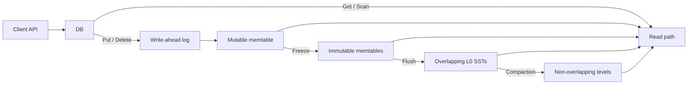

# HermesDB

HermesDB is an embedded LSM-tree storage engine in C++20. Open a directory,
then `Put` / `Get` / `Delete` / `Scan` from the same process. It is derived
from [Mini-LSM](https://github.com/skyzh/mini-lsm) and adds MVCC snapshots,
WAL recovery, and multiple compaction policies.

## Use it from another project

### CMake `find_package`

Install the library, then link `hermesdb::hermesdb`:

```sh
cmake -S . -B build -DCMAKE_BUILD_TYPE=Release
cmake --build build
cmake --install build --prefix /usr/local
```

```cmake
find_package(HermesDB REQUIRED)
target_link_libraries(app PRIVATE hermesdb::hermesdb)
```

```cpp
#include <hermesdb/db.hpp>

auto db = hermesdb::DB::Open("my.db");
db->Put("key", "value");
auto value = db->Get("key");
```

### CMake FetchContent

```cmake
include(FetchContent)
FetchContent_Declare(hermesdb
  GIT_REPOSITORY https://github.com/your-org/hermesdb.git
  GIT_TAG v0.1.0)
set(HERMESDB_BUILD_TESTS OFF CACHE BOOL "" FORCE)
set(HERMESDB_BUILD_APPS OFF CACHE BOOL "" FORCE)
set(HERMESDB_BUILD_EXAMPLES OFF CACHE BOOL "" FORCE)
FetchContent_MakeAvailable(hermesdb)
target_link_libraries(app PRIVATE hermesdb::hermesdb)
```

### C API (FFI)

C, Python ctypes, and other languages can call the same engine:

```c
#include <hermesdb.h>

hermesdb_options_t options;
hermesdb_options_init(&options);
options.enable_wal = 1;

char* err = NULL;
hermesdb_t* db = hermesdb_open("my.db", &options, &err);
hermesdb_put(db, "key", 3, "value", 5, &err);
size_t n = 0;
char* value = hermesdb_get(db, "key", 3, &n, &err);
hermesdb_free(value);
hermesdb_close(db);
```

Error strings and `hermesdb_get` buffers are heap-allocated; free them with
`hermesdb_free`. Missing keys return `NULL` without setting `err`.

## Build this repository

Requires CMake 3.21+, Ninja, and a C++20 compiler.

```sh
cmake --preset default
cmake --build --preset default
ctest --preset default --output-on-failure
```

Examples: `./build/debug/examples/hermesdb_hello_cpp` and
`hermesdb_hello_c`. Benchmarks and the REPL: see [docs/tools.md](docs/tools.md).
API details: [docs/api.md](docs/api.md).

## Architecture



Writes land in a memtable (and optionally a WAL). Flushes produce SST files.
Gets search newest-first: memtables, then L0, then lower levels. Internal keys
are `(user key, timestamp)` so snapshots can read a consistent version.

## License

MIT for this repository (`LICENSE`). Mini-LSM attribution is in
`docs/upstream.md`.
