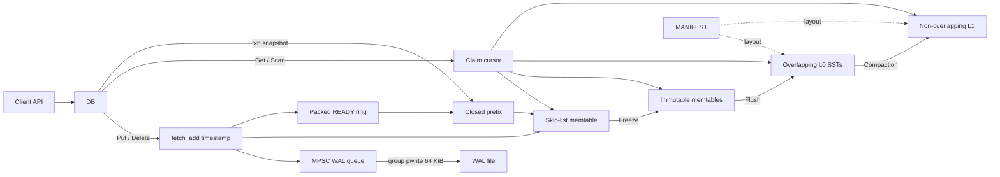

# Architecture

HermesDB is an embedded LSM with MVCC internal keys `(user key, timestamp)`.
Timestamps increase per commit. Within a user key, versions sort **newest
first** (timestamp descending). Deletes are empty values (tombstones).

## Components

| Piece | Role |
| --- | --- |
| Mutable memtable | Concurrent skip list of the newest versions |
| Immutable memtables | Frozen skip lists waiting to flush |
| L0 SSTs | Flushed files; ranges may overlap; newest first |
| L1 SSTs | Compacted, non-overlapping run |
| WAL | Optional redo; MPSC enqueue, grouped `pwrite` |
| MANIFEST | Durable L0/L1 and memtable identity |

Public headers: `hermesdb/db.hpp`, `hermesdb/transaction.hpp`,
`hermesdb/hermesdb.hpp`. C ABI: `hermesdb.h`. Internals (block, table,
memtable, persistence) live under `include/hermesdb/` for the engine and
tests; they are not the supported application surface.

## Write path

A plain `Put` / `Delete` / `WriteBatch` does **not** take the transaction
commit mutex.

1. Claim a timestamp (`fetch_add` on a writer-only cache line).
2. Encode an MVCC WAL frame (if WAL is enabled) and **MPSC-enqueue** it.
   The frame is in memory; it is not necessarily on disk yet.
3. Insert `(InternalKey(user, timestamp), value)` into the mutable skip list.
4. Mark that timestamp READY and try to close the consecutive prefix. Put
   **does not wait** for other keys’ timestamps. `next_timestamp` and
   `visible_timestamp` sit on separate cache lines.
5. Maybe freeze the memtable if it exceeds `target_sst_size`. Only one Put
   takes the freeze locks; the others return and keep writing.
6. After the skip-list insert is done, `flush_if_needed` may `pwrite` the WAL
   when the queue holds at least 64 KiB and no other thread is already
   draining. `Sync`, freeze, flush, and close drain the queue first.

Plain `Get` / `Scan` read at the claim cursor so the same thread sees its
insert without joining the prefix chain. `NewTransaction` waits until the
closed prefix covers every timestamp claimed before begin (snapshot
isolation).

Get can return a key whose WAL frame is still queued. That is **visibility
before durability**, not a broken version order. `Sync()` waits for a drain
plus `fsync`.

Engine state ownership is an atomic `shared_ptr<const State>`. Hot Gets and
Puts acquire raw state views through a two-epoch reader counter; publication
advances the epoch and waits for readers of the retired epoch before releasing
the old owner. Each mutable-memtable generation has a writer gate: freeze
prepares the next WAL and memtable, seals the old gate, waits only for writers
already using that generation, then publishes the new state. Flush and
compaction retain owning snapshots while they work. Transaction `Commit` still
serializes on `commit_mutex` for snapshot isolation / SSI validation; those
paths are not the YCSB `Put` path.

## Memtable skip list

The memtable is one skip list per table (mutable or immutable), not a
`std::map` and not sharded maps.

- Nodes are **insert-only** until the whole table is destroyed. A tombstone
  is a new node with an empty value.
- Height is geometric (max 16). Search follows `next` with acquire loads.
- Insert locks predecessor nodes in address order, validates links, then
  splices. Two Puts of the **same user key** with **different timestamps**
  are different nodes and can proceed concurrently.
- Overwriting the exact same `InternalKey` (same user key and timestamp)
  updates that node’s value under the node mutex.

Flush copies `entries()` in key order into an SST. After freeze, that table
should not receive new Puts.

## Read path

Point `Get` at the claim cursor (or a transaction’s snapshot timestamp)
walks **newest to oldest**: mutable memtable, immutables, L0, then L1.
Each SST may skip via Bloom filter and key-range metadata, then `pread`s
one data block (checksum, optional zlib decode). `DB` keeps an LRU
`BlockCache` keyed by `(table id, block index)` when
`Options::block_cache_capacity` is positive (default 4096 blocks; `0`
disables it). The cache is split into up to 16 shard LRUs so Gets do not
share one mutex. The first visible version at the read timestamp wins; an
empty value is a tombstone.

`Scan` is a move-only cursor over one state snapshot. Sources pull
16-row batches (one restart interval). Memtable and SST batches are
merged by `InternalKey` (newer sources win on ties), then collapsed
to the newest visible user key. User-key compares and same-user skips
use 16-byte NEON/SSE2 paths when the key is contiguous. Public `next()`
pops the filtered batch. Tombstones and
keys outside the requested bounds are skipped as the cursor advances.
SST scans admit blocks as non-point cache entries (they cannot evict
point-read blocks). A cache miss reads the current block plus the next four
in one `pread`, decodes them into the cache, and hints kernel readahead on
file-backed tables. Opening an SST from disk
loads only the index and Bloom filter; `Table::open(Bytes)` still holds
a full in-memory image for unit tests. A `DbIterator` must not be used
after `DB::Close`; a transaction scan must be consumed before `Commit`
and is invalid after the transaction completes.

## SST layout and compression

Data blocks prefix-compress keys against the last restart (every 16
entries, overlap 0). Seek binary-searches restart keys, then scans at
most 15 entries. The block footer stores entry offsets, the restart
interval, and an `RST1` magic so older offset-only footers still decode.

Checksums stay CRC-32 (zlib polynomial) for compatibility. ARM uses the
CRC32 instruction; other CPUs use slicing-by-8. This is not CRC-32C.

Uncompressed tables (`Compression::none`, default) keep the original block
concatenation plus checksums.

`Compression::zlib` writes packed tables (`HDB1` footer):

- Each block is zlib-compressed when that shrinks it; otherwise stored raw.
- Metadata stores `(offset, size)` per block so a Get can slice one payload.
- Payloads that fit are packed toward 4 KiB device pages; oversize payloads
  are not padded back to 4 KiB.

WAL bytes are **not** compressed. Benchmark values that cycle `a`–`z`
compress well; random payloads will not.

## Recovery

On open, the MANIFEST rebuilds L0/L1. WAL files replay into memtables with
embedded timestamps. `next_timestamp` and `visible_timestamp` advance to
the maximum recovered timestamp. Truncated WAL tails are tolerated; checksum
failures on a complete frame are errors.

## Concurrency (current limits)

- Many threads may `Put` at once. Skip-list insertion publishes level 0 with
  CAS, then installs best-effort upper-level index links without predecessor
  locks. Put marks READY and returns; it does not wait for a global closed
  prefix. Snapshots wait for that prefix. Extra Puts skip freeze with
  `try_lock` instead of queueing on `state_change_mutex`; that mutex serializes
  publishers only. WAL append accepts non-owning key/value views and encodes
  directly into trailing storage in a single queue-node allocation. WAL drain
  reuses a staging buffer and holds its drain mutex through `pwrite`/`sync`, so
  concurrent drainers cannot reorder queue segments. `BlockCache` is sharded
  (up to 16 LRUs).
- `Get` does not take the commit mutex.
- Load in `hermesdb_bench` is single-threaded; `--threads` applies to the
  run phase only.
- `io_uring` / thread-pool I/O backends are not implemented; I/O is
  synchronous `pwrite`/`pread` (SST Gets `pread` one block).

## Source layout

- `src/memtable/` — skip list
- `src/storage/` — `DB`, freeze/flush/compaction orchestration, timestamps
- `src/persistence/` — WAL + MANIFEST
- `src/block/`, `src/table/` — SST blocks, Bloom, packed compression
- `src/compaction/` — simple-leveled, leveled, tiered
- `src/capi/` — C ABI
