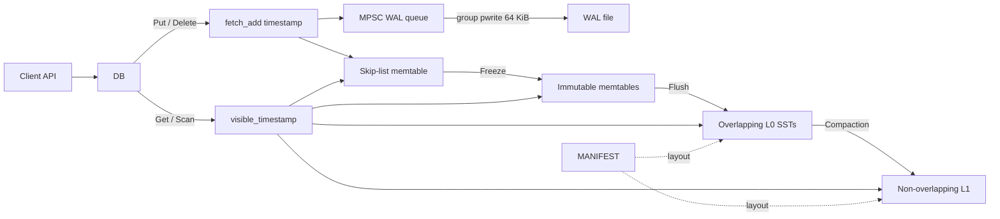

# Architecture

HermesDB is an embedded LSM with MVCC internal keys `(user key, timestamp)`.
Timestamps increase per commit. Within a user key, versions sort **newest
first** (timestamp descending). Deletes are empty values (tombstones).

## Components

| Piece | Role |
| --- | --- |
| Mutable memtable | Concurrent skip list of the newest versions |
| Immutable memtables | Frozen skip lists waiting to flush |
| L0 SSTs | Flushed files; ranges may overlap; newest first |
| L1 SSTs | Compacted, non-overlapping run |
| WAL | Optional redo; MPSC enqueue, grouped `pwrite` |
| MANIFEST | Durable L0/L1 and memtable identity |

Public headers: `hermesdb/db.hpp`, `hermesdb/transaction.hpp`,
`hermesdb/hermesdb.hpp`. C ABI: `hermesdb.h`. Internals (block, table,
memtable, persistence) live under `include/hermesdb/` for the engine and
tests; they are not the supported application surface.

## Write path

A plain `Put` / `Delete` / `WriteBatch` does **not** take the transaction
commit mutex.

1. `timestamp = next_timestamp.fetch_add(1) + 1`.
2. Encode an MVCC WAL frame (if WAL is enabled) and **MPSC-enqueue** it.
   The frame is in memory; it is not necessarily on disk yet.
3. Insert `(InternalKey(user, timestamp), value)` into the mutable skip list.
4. Publish: wait until `visible_timestamp == timestamp - 1`, then store
   `visible_timestamp = timestamp`. Get/Scan/`NewTransaction` use this
   **closed prefix**, so they never see commit *T* without *T−1*.
5. Maybe freeze the memtable if it exceeds `target_sst_size`.
6. After the skip-list insert is done, `flush_if_needed` may `pwrite` the WAL
   when the queue holds at least 64 KiB. `Sync`, freeze, flush, and close
   drain the queue first.

Get can return a key whose WAL frame is still queued. That is **visibility
before durability**, not a broken version order. `Sync()` waits for a drain
plus `fsync`.

Freeze takes a unique lock on engine state so in-flight Puts (shared lock
while inserting) finish on the memtable being frozen. Transaction `Commit`
still serializes on `commit_mutex` for snapshot isolation / SSI validation;
those paths are not the YCSB `Put` path.

## Memtable skip list

The memtable is one skip list per table (mutable or immutable), not a
`std::map` and not sharded maps.

- Nodes are **insert-only** until the whole table is destroyed. A tombstone
  is a new node with an empty value.
- Height is geometric (max 16). Search follows `next` with acquire loads.
- Insert locks predecessor nodes in address order, validates links, then
  splices. Two Puts of the **same user key** with **different timestamps**
  are different nodes and can proceed concurrently.
- Overwriting the exact same `InternalKey` (same user key and timestamp)
  updates that node’s value under the node mutex.

Flush copies `entries()` in key order into an SST. After freeze, that table
should not receive new Puts.

## Read path

Point `Get` at `visible_timestamp` (or a transaction’s snapshot timestamp)
walks **newest to oldest**: mutable memtable, immutables, L0, then L1.
Each SST may skip via Bloom filter and key-range metadata, then `pread`s
one data block (checksum, optional zlib decode). `DB` keeps an LRU
`BlockCache` keyed by `(table id, block index)` when
`Options::block_cache_capacity` is positive (default 4096 blocks; `0`
disables it). The first visible version at the read timestamp wins; an
empty value is a tombstone.

`Scan` still materializes the merged view. Opening an SST from disk loads
only the index and Bloom filter; `Table::open(Bytes)` still holds a full
in-memory image for unit tests.

## SST layout and compression

Uncompressed tables (`Compression::none`, default) keep the original block
concatenation plus checksums.

`Compression::zlib` writes packed tables (`HDB1` footer):

- Each block is zlib-compressed when that shrinks it; otherwise stored raw.
- Metadata stores `(offset, size)` per block so a Get can slice one payload.
- Payloads that fit are packed toward 4 KiB device pages; oversize payloads
  are not padded back to 4 KiB.

WAL bytes are **not** compressed. Benchmark values that cycle `a`–`z`
compress well; random payloads will not.

## Recovery

On open, the MANIFEST rebuilds L0/L1. WAL files replay into memtables with
embedded timestamps. `next_timestamp` and `visible_timestamp` advance to
the maximum recovered timestamp. Truncated WAL tails are tolerated; checksum
failures on a complete frame are errors.

## Concurrency (current limits)

- Many threads may `Put` at once; Zipfian hot keys still contend on skip-list
  predecessor locks and on **publish** if a lower timestamp is late.
- `Get` does not take the commit mutex.
- Load in `hermesdb_bench` is single-threaded; `--threads` applies to the
  run phase only.
- `io_uring` / thread-pool I/O backends are not implemented; I/O is
  synchronous `pwrite`/`pread` (files currently loaded as whole SSTs).

## Source layout

- `src/memtable/` — skip list
- `src/storage/` — `DB`, freeze/flush/compaction orchestration, timestamps
- `src/persistence/` — WAL + MANIFEST
- `src/block/`, `src/table/` — SST blocks, Bloom, packed compression
- `src/compaction/` — simple-leveled, leveled, tiered
- `src/capi/` — C ABI
